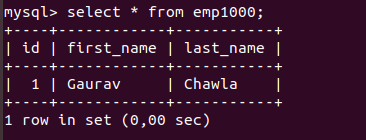

# Simple example using hibernate

This example is a simple example to get familiar with hibernate the code may not be clean

# Usage

1- Make sure you've created your database.
2- Replace whatever needs to be replaced in hibernate.cfg.xml to communicate with your database.
3- Create the table. Example in MySQL :

```sql
CREATE TABLE emp1000 (
  id INT PRIMARY KEY AUTO_INCREMENT,
  first_name VARCHAR(255),
  last_name VARCHAR(255)
);
```

Compile and launch :

```sh
javac -d out src/com/javatpoint/mypackage/Employee.java
javac -d out -cp "out/:lib/*" src/com/javatpoint/mypackage/StoreData.java
java -cp ".:out/:lib/*" com.javatpoint.mypackage.StoreData
```

You should have something like the image below in your table :


