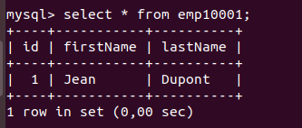

# Simple example using hibernate

This example is a simple example to get familiar with hibernate and JPA the code may not be clean

# Usage

1- Make sure you've created your database.
2- Replace whatever needs to be replaced in hibernate.cfg.xml to communicate with your database.

Compile and launch :

```sh
javac -sourcepath src -d out -cp "lib/*" src/com/javatpoint/mypackage/Employee.java
javac -sourcepath src -d out -cp "out/:lib/*" src/com/javatpoint/mypackage/StoreData.java
java -cp ".:out/:lib/*" com.javatpoint.mypackage.StoreData
```

You should have something like the image below in your table :


